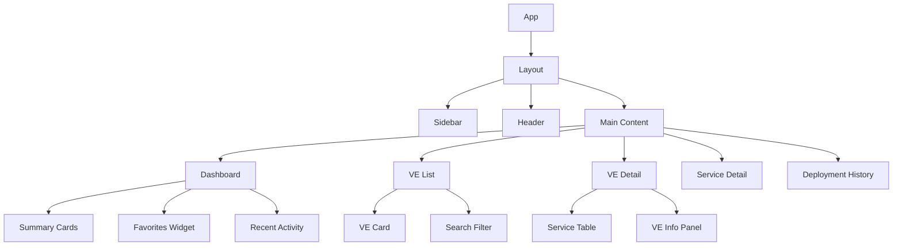

# Griffin Platform Deployment - Frontend Architecture

## Technology Stack

### Core Technologies
- **React 18+**: Modern React with Hooks, Suspense, Concurrent Features
- **TypeScript 5+**: Strong typing for better development experience
- **Fluent UI v9**: Microsoft's design system for consistency
- **Axios**: HTTP client for API communication
- **React Router v6**: Client-side routing and navigation

### Development Tools
- **Vite**: Fast build tool and development server
- **ESLint + Prettier**: Code quality and formatting
- **Jest + React Testing Library**: Unit and integration testing
- **Storybook**: Component development and documentation

## Project Structure

```
src/
├── components/           # Reusable UI components
│   ├── common/          # Generic components (Button, Modal, etc.)
│   ├── layout/          # Layout components (Header, Sidebar)
│   └── forms/           # Form-specific components
├── pages/               # Page components
│   ├── Dashboard/
│   ├── VirtualEnvironments/
│   ├── Services/
│   └── DeploymentHistory/
├── hooks/               # Custom React hooks
├── services/            # API service layer
├── types/               # TypeScript type definitions
├── utils/               # Utility functions
├── constants/           # Application constants
└── styles/              # Global styles and themes
```

## Component Architecture

### Design Principles
1. **Single Responsibility**: Each component has one clear purpose
2. **Composition over Inheritance**: Build complex UIs from simple components
3. **Props Interface**: Clear, typed interfaces for all components
4. **Separation of Concerns**: Logic, presentation, and data separate

### Component Hierarchy



## State Management

### State Architecture
Using React's built-in state management with strategic lifting and custom hooks:

#### Local State (useState)
- Component-specific UI state
- Form inputs and validation
- Modal open/close states
- Loading states for individual components

#### Shared State (Context API)
- User authentication state
- Global loading states
- Theme/preferences
- Selected items across pages

#### Server State (React Query/SWR)
- API data fetching and caching
- Background refetching
- Optimistic updates
- Error handling

### Custom Hooks Strategy

#### Data Hooks
```typescript
// Virtual Environments
useVirtualEnvironments() - Fetch and manage VE list
useVirtualEnvironment(id) - Single VE details
useFavoriteVEs() - User's favorite VEs

// Services  
useServices(filters) - Filtered service list
useService(id) - Single service details
useServiceDeployment(id) - Deployment operations

// Deployment History
useDeploymentHistory(filters) - Deployment records
useDeploymentLogs(id) - Real-time logs
```

#### UI Hooks
```typescript
useModal() - Modal state management
useSearch(data, searchFields) - Search functionality
useFilters(defaultFilters) - Filter state
usePagination(data, pageSize) - Pagination logic
useNotifications() - Toast/notification system
```

## Data Flow & API Integration

### API Service Layer

```typescript
// services/api.ts
class ApiService {
  // Virtual Environments
  getVirtualEnvironments(): Promise<VE[]>
  getVirtualEnvironment(id: string): Promise<VEDetail>
  getVEServices(veId: string): Promise<Service[]>
  
  // Services
  getServices(filters?: ServiceFilters): Promise<Service[]>
  getService(id: string): Promise<ServiceDetail>
  deployService(id: string, config: DeployConfig): Promise<Deployment>
  
  // Deployments
  getDeploymentHistory(filters?: HistoryFilters): Promise<Deployment[]>
  getDeploymentLogs(id: string): Promise<string[]>
  cancelDeployment(id: string): Promise<void>
}
```

### Data Types

```typescript
// types/virtualEnvironment.ts
interface VirtualEnvironment {
  id: string;
  name: string;
  type: 'SovBase' | 'ModelBSov' | 'ModelB2Sov';
  services: Service[];
  lastDeployment?: Date;
  status: 'active' | 'inactive' | 'deploying';
  isFavorite: boolean;
}

// types/service.ts
interface Service {
  id: string;
  name: string;
  buildType: 'RingPromotion' | 'Standard';
  pipelineId: number;
  buildRoot: string;
  currentVersion?: string;
  status: 'active' | 'deploying' | 'failed';
  virtualEnvironments: string[];
}

// types/deployment.ts
interface Deployment {
  id: string;
  serviceId: string;
  serviceName: string;
  virtualEnvironment: string;
  version: string;
  status: 'success' | 'failed' | 'in-progress' | 'cancelled';
  startTime: Date;
  endTime?: Date;
  duration?: number;
  user: string;
  logs?: string[];
}
```

## Performance Optimization

### Code Splitting
```typescript
// Lazy load major sections
const Dashboard = lazy(() => import('./pages/Dashboard'));
const VEList = lazy(() => import('./pages/VirtualEnvironments'));
const ServiceDetail = lazy(() => import('./pages/Services/ServiceDetail'));
```

### Memoization Strategy
```typescript
// Expensive calculations
const processedServices = useMemo(() => {
  return services.filter(filterFn).sort(sortFn);
}, [services, filters, sorting]);

// Component memoization
const VECard = memo(({ ve, onFavorite, onDeploy }: VECardProps) => {
  // Component implementation
});
```

### Virtual Scrolling
For large lists (services, deployment history):
```typescript
import { FixedSizeList as List } from 'react-window';

const ServiceList = ({ services }: { services: Service[] }) => (
  <List
    height={600}
    itemCount={services.length}
    itemSize={80}
    itemData={services}
  >
    {ServiceRow}
  </List>
);
```

## Error Handling & Loading States

### Error Boundaries
```typescript
class ErrorBoundary extends Component<Props, State> {
  constructor(props: Props) {
    super(props);
    this.state = { hasError: false, error: null };
  }
  
  static getDerivedStateFromError(error: Error) {
    return { hasError: true, error };
  }
  
  render() {
    if (this.state.hasError) {
      return <ErrorFallback error={this.state.error} />;
    }
    return this.props.children;
  }
}
```

### Suspense & Loading
```typescript
// Suspense boundaries for async components
<Suspense fallback={<PageSkeleton />}>
  <Routes>
    <Route path="/dashboard" element={<Dashboard />} />
    <Route path="/ve" element={<VEList />} />
  </Routes>
</Suspense>

// Loading states with Skeleton UI
const VECardSkeleton = () => (
  <div className="animate-pulse">
    <div className="bg-gray-200 h-4 rounded mb-2"></div>
    <div className="bg-gray-200 h-3 rounded w-3/4"></div>
  </div>
);
```

## Real-time Features

### WebSocket Integration
```typescript
// hooks/useWebSocket.ts
export const useDeploymentStatus = (deploymentId: string) => {
  const [status, setStatus] = useState<DeploymentStatus>();
  
  useEffect(() => {
    const ws = new WebSocket(`ws://api/deployments/${deploymentId}/status`);
    
    ws.onmessage = (event) => {
      const update = JSON.parse(event.data);
      setStatus(update);
    };
    
    return () => ws.close();
  }, [deploymentId]);
  
  return status;
};
```

### Server-Sent Events for Logs
```typescript
// hooks/useDeploymentLogs.ts
export const useDeploymentLogs = (deploymentId: string) => {
  const [logs, setLogs] = useState<string[]>([]);
  
  useEffect(() => {
    const eventSource = new EventSource(`/api/deployments/${deploymentId}/logs`);
    
    eventSource.onmessage = (event) => {
      setLogs(prev => [...prev, event.data]);
    };
    
    return () => eventSource.close();
  }, [deploymentId]);
  
  return logs;
};
```

## Testing Strategy

### Unit Tests
```typescript
// components/__tests__/VECard.test.tsx
describe('VECard', () => {
  it('renders VE information correctly', () => {
    const mockVE = createMockVE();
    render(<VECard ve={mockVE} onFavorite={jest.fn()} onDeploy={jest.fn()} />);
    
    expect(screen.getByText(mockVE.name)).toBeInTheDocument();
    expect(screen.getByText(`${mockVE.services.length} services`)).toBeInTheDocument();
  });
  
  it('calls onFavorite when star is clicked', () => {
    const mockVE = createMockVE();
    const onFavorite = jest.fn();
    render(<VECard ve={mockVE} onFavorite={onFavorite} onDeploy={jest.fn()} />);
    
    fireEvent.click(screen.getByLabelText('Add to favorites'));
    expect(onFavorite).toHaveBeenCalledWith(mockVE.id);
  });
});
```

### Integration Tests
```typescript
// pages/__tests__/Dashboard.integration.test.tsx
describe('Dashboard Integration', () => {
  it('loads and displays dashboard data', async () => {
    mockApi.getVirtualEnvironments.mockResolvedValue(mockVEs);
    mockApi.getDeploymentHistory.mockResolvedValue(mockDeployments);
    
    render(<Dashboard />);
    
    await waitFor(() => {
      expect(screen.getByText('17')).toBeInTheDocument(); // Total VEs
      expect(screen.getByText('156')).toBeInTheDocument(); // Active Services
    });
  });
});
```

## Security Considerations

### Authentication
```typescript
// contexts/AuthContext.tsx
interface AuthContextType {
  user: User | null;
  login: (credentials: LoginCredentials) => Promise<void>;
  logout: () => void;
  isAuthenticated: boolean;
}

// components/ProtectedRoute.tsx
const ProtectedRoute = ({ children }: { children: ReactNode }) => {
  const { isAuthenticated } = useAuth();
  
  if (!isAuthenticated) {
    return <Navigate to="/login" replace />;
  }
  
  return <>{children}</>;
};
```

### Input Validation
```typescript
// utils/validation.ts
export const validateDeploymentConfig = (config: DeploymentConfig): ValidationResult => {
  const errors: string[] = [];
  
  if (!config.serviceId) errors.push('Service is required');
  if (!config.environment) errors.push('Environment is required');
  if (!config.version) errors.push('Version is required');
  
  return { isValid: errors.length === 0, errors };
};
```

## Accessibility Implementation

### ARIA Support
```typescript
// components/ServiceTable.tsx
const ServiceTable = ({ services, onDeploy }: ServiceTableProps) => (
  <table role="table" aria-label="Services list">
    <thead>
      <tr role="row">
        <th role="columnheader" aria-sort="ascending">Service</th>
        <th role="columnheader">Status</th>
        <th role="columnheader">Actions</th>
      </tr>
    </thead>
    <tbody>
      {services.map(service => (
        <tr key={service.id} role="row">
          <td role="cell">{service.name}</td>
          <td role="cell">
            <span
              aria-label={`Status: ${service.status}`}
              className={`status-${service.status}`}
            >
              {service.status}
            </span>
          </td>
          <td role="cell">
            <button
              aria-label={`Deploy ${service.name}`}
              onClick={() => onDeploy(service.id)}
            >
              Deploy
            </button>
          </td>
        </tr>
      ))}
    </tbody>
  </table>
);
```

### Keyboard Navigation
```typescript
// hooks/useKeyboardShortcuts.ts
export const useKeyboardShortcuts = () => {
  useEffect(() => {
    const handleKeyPress = (event: KeyboardEvent) => {
      if (event.ctrlKey || event.metaKey) {
        switch (event.key) {
          case 'k': // Ctrl+K for search
            event.preventDefault();
            document.getElementById('search')?.focus();
            break;
          case 'd': // Ctrl+D for dashboard
            event.preventDefault();
            navigate('/dashboard');
            break;
        }
      }
    };
    
    document.addEventListener('keydown', handleKeyPress);
    return () => document.removeEventListener('keydown', handleKeyPress);
  }, [navigate]);
};
```

This architecture provides a solid foundation for building a scalable, maintainable, and user-friendly Griffin Platform Deployment interface.
