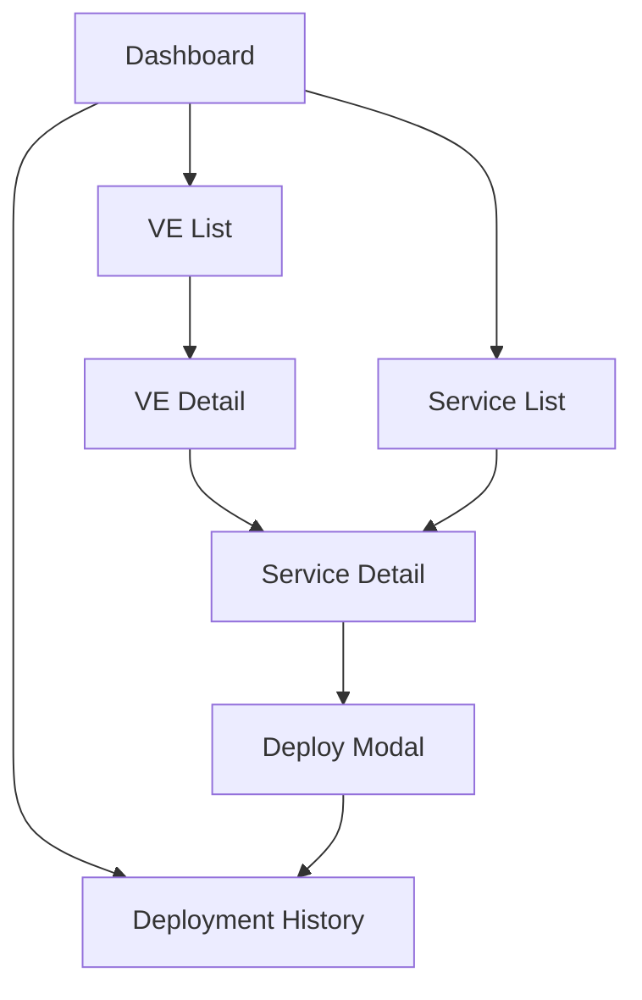

# Griffin Platform Deployment - UI/UX Design Documentation

## Design Principles

### 1. Clarity & Simplicity
- **Clear Visual Hierarchy**: Use consistent typography, spacing, and color coding
- **Minimal Cognitive Load**: Present information progressively, avoid overwhelming users
- **Consistent Navigation**: Left sidebar navigation with clear module separation

### 2. Efficiency & Speed
- **Quick Access**: Favorite VEs for frequent deployments
- **Batch Operations**: Deploy multiple services simultaneously
- **Smart Defaults**: Use default pipelines for faster deployment
- **Search & Filter**: Quick filtering across all major lists

### 3. Trust & Reliability
- **Status Indicators**: Clear visual feedback for deployment states
- **Progress Tracking**: Real-time deployment progress with detailed logs
- **Confirmation Dialogs**: Prevent accidental deployments
- **Audit Trail**: Complete deployment history with user tracking

## Page Structure & Navigation

### Layout System
```
┌─────────────────────────────────────────────┐
│ [Left Sidebar - 256px]  │ [Main Content]   │
│                         │                  │
│ • Dashboard             │ [Header]         │
│ • Virtual Environments │ [Content Area]   │
│ • Services              │                  │
│ • Deployment History    │                  │
└─────────────────────────────────────────────┘
```

### Navigation Flow


## Page-by-Page Interaction Design

### 1. Dashboard (dashboard.html)

#### Functional Modules
- **Summary Cards**: Total VEs, Active Services, Pending/Failed Deployments
- **Favorites Widget**: Quick access to starred VEs with one-click deploy
- **Recent Activity**: Real-time deployment status updates
- **Environment Overview**: High-level statistics by VE type

#### User Action Flows
1. **Quick Deploy from Favorites**
   - User clicks "Deploy" on favorite VE → Confirmation modal → Deployment starts
   - System response: Progress indicator, redirect to deployment history

2. **Navigation to Details**
   - User clicks VE name → Navigate to VE detail page
   - User clicks service name → Navigate to service detail page

#### Data Presentation
- **Cards Layout**: Grid-based dashboard widgets
- **Status Colors**: Green (success), Yellow (in-progress), Red (failed)
- **Time-based Data**: "2 minutes ago", "1 hour ago" format

### 2. Virtual Environment List (ve-list.html)

#### Functional Modules
- **Search & Filter Bar**: Text search + VE type filter
- **VE Cards Grid**: Responsive card layout with key information
- **Favorites System**: Star/unstar VEs for quick access
- **Batch Actions**: Deploy multiple VEs simultaneously

#### User Action Flows
1. **VE Management**
   - Search VEs → Filter results appear immediately
   - Star VE → Visual feedback (filled star), add to favorites
   - Click "View Details" → Navigate to VE detail page

2. **Deployment Actions**
   - Click "Deploy All" → Confirmation modal → Batch deployment
   - Select multiple VEs → "Deploy Selected" button enabled

#### Data Presentation
- **Card Layout**: VE name, type badge, service count, last deployment time
- **Status Indicators**: Color-coded badges for VE types
- **Responsive Grid**: 1-4 columns based on screen size

### 3. VE Detail Page (ve-detail.html)

#### Functional Modules
- **VE Information Panel**: Statistics and metadata
- **Services Table**: Sortable, filterable service list
- **Service Actions**: Individual service deployment controls
- **Bulk Operations**: Select multiple services for batch deployment

#### User Action Flows
1. **Service Management**
   - Search/filter services → Table updates dynamically
   - Click service name → Navigate to service detail page
   - Select services → Enable "Deploy Selected" button

2. **Deployment Operations**
   - Click "Deploy" for service → Deployment configuration modal
   - Select pipeline, build version → Confirm deployment
   - System response: Progress tracking, status updates

#### Data Presentation
- **Table Layout**: Service, Status, Pipeline, Version, Last Deployed columns
- **Progressive Disclosure**: Basic info visible, details on demand
- **Action Icons**: View, Deploy, Build info buttons per service

### 4. Service Detail Page (service-detail.html)

#### Functional Modules
- **Service Information**: Build type, pipelines, configuration
- **Build Information**: URLs, patterns, versioning
- **Deployment History**: Chronological deployment records
- **Quick Actions Sidebar**: Deploy, logs, pipeline links

#### User Action Flows
1. **Service Configuration**
   - View build URLs → Copy to clipboard functionality
   - Check deployment history → Click for detailed logs
   - Access pipeline → External link to CloudBuild

2. **Deployment Process**
   - Click "Deploy Service" → Configuration modal
   - Select environment, pipeline, version → Confirm
   - Monitor progress → View real-time logs

#### Data Presentation
- **Two-column Layout**: Main content + sidebar
- **Information Sections**: Collapsible sections for different data types
- **Version Timeline**: Chronological list with status indicators

### 5. Service List (service-list.html)

#### Functional Modules
- **Global Search**: Search across all services
- **Advanced Filtering**: By VE, build type, status
- **View Toggle**: Grid/list view options
- **Batch Operations**: Multi-select for deployments

#### User Action Flows
1. **Service Discovery**
   - Search by name → Real-time results filtering
   - Filter by status → Update grid immediately
   - Toggle view mode → Preserve selections

2. **Service Actions**
   - Click service card → Navigate to service detail
   - Select multiple services → Enable batch actions
   - Deploy service → Configuration modal

#### Data Presentation
- **Grid Layout**: Service cards with key information
- **Status-based Grouping**: Visual separation by deployment status
- **Responsive Design**: Adapts to screen size

### 6. Deployment History (deployment-history.html)

#### Functional Modules
- **Summary Metrics**: Success/failure statistics
- **Deployment Table**: Detailed deployment records
- **Log Viewer**: Modal for deployment logs
- **Export/Filter**: Data export and advanced filtering

#### User Action Flows
1. **History Analysis**
   - Search deployments → Filter table results
   - Filter by status/date → Update table immediately
   - View deployment logs → Modal with formatted output

2. **Redeployment Actions**
   - Click "Redeploy" → Confirmation dialog
   - Cancel active deployment → Confirmation dialog
   - Export data → Download functionality

#### Data Presentation
- **Tabular Layout**: Chronological deployment records
- **Status Visualization**: Color-coded status indicators
- **Progress Bars**: For active deployments

## Component Design System

### Color Palette
```css
/* Status Colors */
--success: #10B981 (green-500)
--warning: #F59E0B (yellow-500)
--error: #EF4444 (red-500)
--info: #3B82F6 (blue-500)

/* UI Colors */
--primary: #1E40AF (blue-700)
--secondary: #6B7280 (gray-500)
--background: #F9FAFB (gray-50)
--surface: #FFFFFF (white)
```

### Typography Scale
```css
/* Headers */
h1: 2xl (24px) - semibold
h2: xl (20px) - semibold  
h3: lg (18px) - semibold

/* Body */
body: base (16px) - normal
small: sm (14px) - normal
micro: xs (12px) - medium
```

### Interactive Elements

#### Buttons
- **Primary**: Blue background, white text, rounded corners
- **Secondary**: White background, blue border, blue text
- **Danger**: Red variants for destructive actions
- **Icon Buttons**: Square, minimal padding, hover states

#### Form Controls
- **Input Fields**: Border, focus ring, placeholder text
- **Select Dropdowns**: Consistent styling with inputs
- **Checkboxes**: Rounded, custom styling
- **Search Fields**: Icon prefix, clear functionality

#### Status Indicators
- **Badges**: Rounded pills with status colors
- **Progress Bars**: Animated for active operations
- **Icons**: Lucide icon set for consistency

## Responsive Design

### Breakpoints
- **Mobile**: < 768px (1 column layouts)
- **Tablet**: 768px - 1024px (2-3 column layouts)
- **Desktop**: > 1024px (Full 4-column layouts)

### Mobile Adaptations
- **Sidebar**: Collapsible overlay on mobile
- **Tables**: Horizontal scroll or card transformation
- **Modals**: Full-screen on small devices
- **Touch Targets**: 44px minimum for mobile interaction

## Accessibility Considerations

### WCAG Compliance
- **Color Contrast**: 4.5:1 ratio for text
- **Keyboard Navigation**: Full functionality without mouse
- **Screen Reader**: Semantic HTML, ARIA labels
- **Focus Indicators**: Clear focus rings

### Progressive Enhancement
- **Core Functionality**: Works without JavaScript
- **Enhanced Experience**: JavaScript adds interactivity
- **Graceful Degradation**: Fallbacks for failed operations

This design system ensures consistency, usability, and maintainability across the Griffin Platform Deployment interface.
